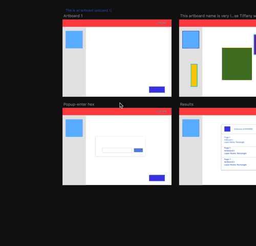

# Color Finder - Sketch Plugin

A plugin to find all instances of an HEX color in your Sketch file page.

## Demo

## Installation

- [Download](../../releases/latest/download/color-locator.sketchplugin.zip) the latest release of the plugin
- Un-zip
- Double-click on color-locator.sketchplugin

## Credits
- The code: [Adria Navarro](https://github.com/anavarromartin)
- The design and the art: [Tiffany Nieh](http://www.tiffanynieh.com/)